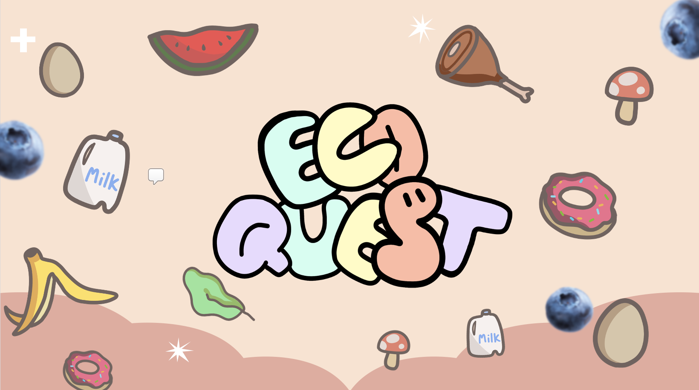

# EcoQuest

## About

<!-- You will want to modify the text below to include a short description of your app -->
<!-- You will want to modify the documentation link to your app's help page -->

EcoQuest is an educational website that tackles food waste and sustainability. Through fin games, competitive quizzes, and info pages, EcoQuest encourages children to learn more about safe storage of perishables, how to read food labels, and how to reduce food waste. [Click here to learn more!](https://docs.google.com/presentation/d/1s7sYGJTobEPnLxg2mBbwVDIHjKSCVZRR/edit?usp=drive_link&ouid=104317812811768941791&rtpof=true&sd=true)

## Technologies

EcoQuest uses the following technologies: Node.js, React.js, and Bootstrap.

## Getting Started

To get started with the project visit the [`getting started`](docs/GETTING_STARTED.md) documentation. The document outlines how to get a copy running locally/publicly and how to setup the app.

## Contributing

Contributions are always welcome!

See [`CONTRIBUTING`](.github/CONTRIBUTING.md) for ways to get started.

Please adhere to this project's [`code of conduct`](CODE_OF_CONDUCT.md).

## Useful Resources

* [React Documentation](https://react.dev/reference/react)
* [Firebase Documentation](https://firebase.google.com/docs?gad=1&gclid=Cj0KCQjwzdOlBhCNARIsAPMwjbzPQ-Agmh5XfsQcmfi5jzcgb5lp9x1lHb9xjZqGsFUmLq4MXlq2CqYaAnlIEALw_wcB&gclsrc=aw.ds)

## License

The project uses the [MIT LICENSE](https://choosealicense.com/licenses/mit/).

## Authors

<!-- You will want modify the authors list below to include all contributing team members. -->

- Mamon
- Ali
- Erick
- [@hightechu](https://github.com/hightechu)
